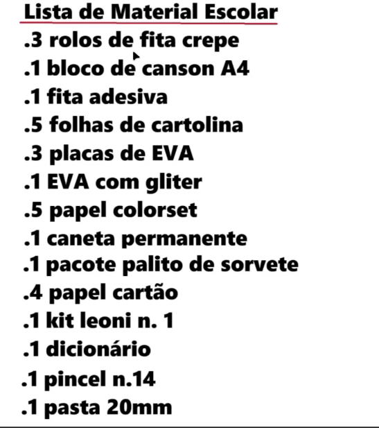

# Lab-AWS-Textract

Este repositório demonstra como utilizar o **AWS Textract** para extrair texto de imagens e convertê-lo em formato de texto estruturado. O AWS Textract é um serviço da Amazon Web Services que utiliza machine learning para detectar e extrair texto, formulários e tabelas de documentos digitalizados.

---

## Como Funciona?

O AWS Textract analisa imagens ou documentos e identifica blocos de texto, tabelas e campos de formulários. Ele retorna o texto extraído em um formato estruturado, permitindo que você utilize os dados em aplicações de processamento de texto, análise de dados ou automação de workflows.

---

## Configuração do Projeto

### Pré-requisitos

1. **Conta AWS**: Você precisa de uma conta na AWS para acessar o serviço Textract.
2. **Credenciais AWS**: Configure as credenciais da AWS (Access Key e Secret Key) no seu ambiente local.
3. **Python e Boto3**: Instale o Python e a biblioteca Boto3 (AWS SDK para Python).

### Passos para Configuração

1. **Crie um Repositório no GitHub**:
   - Crie um novo repositório com o nome `Transcrevendo-Imagem-em-Texto-com-AWS-Textract`.

2. **Instale as Dependências**:
   - Instale o Boto3 usando o pip:
     ```bash
     pip install boto3
     ```

3. **Configure as Credenciais da AWS**:
   - Crie um arquivo `~/.aws/credentials` no seu computador e adicione suas credenciais:
     ```ini
     [default]
     aws_access_key_id = SUA_ACCESS_KEY
     aws_secret_access_key = SUA_SECRET_KEY
     region = us-east-1
     ```

4. **Crie o Script Python**:
   - Crie um arquivo chamado `textract_example.py` com o seguinte código:
     ```python
     import boto3

     def extract_text_from_image(image_path):
         # Inicializa o cliente do Textract
         client = boto3.client('textract', region_name='us-east-1')

         # Lê a imagem em formato binário
         with open(image_path, 'rb') as image_file:
             image_bytes = image_file.read()

         # Chama o Textract para detectar texto
         response = client.detect_document_text(Document={'Bytes': image_bytes})

         # Extrai e exibe o texto detectado
         for item in response['Blocks']:
             if item['BlockType'] == 'LINE':
                 print(item['Text'])

     if __name__ == "__main__":
         extract_text_from_image('exemplo_imagem.jpg')
     ```

5. **Execute o Script**:
   - Coloque uma imagem de exemplo (por exemplo, `exemplo_imagem.jpg`) no mesmo diretório do script e execute:
     ```bash
     python textract_example.py
     ```

---

## Exemplo de Uso

### Imagem de Entrada


### Saída do Textract
Texto extraído da imagem:
Lista de Material Escolar
.3 rolos de fita crepe
.1 bloco de canson A4
.1 fita adesiva
.5 folhas de cartolina
.3 placas de EVA
.1 EVA com gliter
.5 papel colorset
.1 caneta permanente
.1 pacote palito de sorvete
.4 papel cartão
.1 kit leoni n. 1
.1 dicionário
.1 pincel n.14
.1 pasta 20mm
